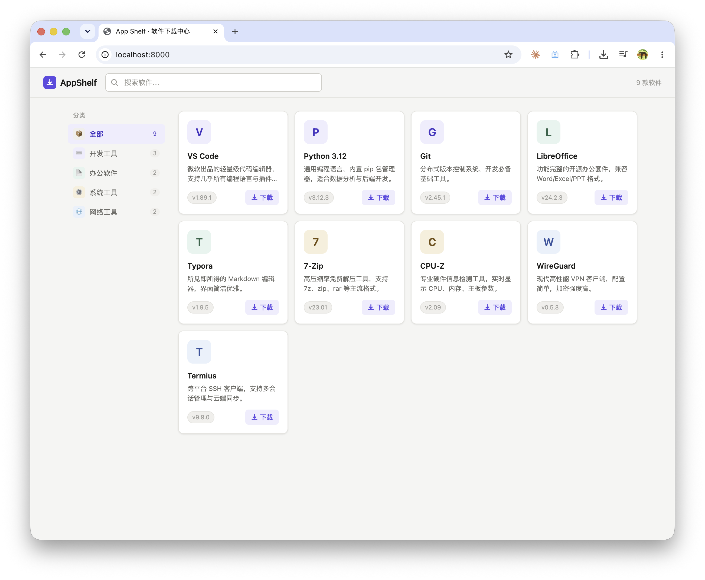

# App Shelf · 内网软件下载中心

轻量级内网软件分发工具，基于 FastAPI + 单文件 HTML，零数据库，配置即服务。


## 快速开始

### 方式一：Docker Compose（推荐）

```bash
docker compose up -d
```

访问 http://localhost:8000

### 方式二：本地运行

```bash
pip install -r requirements.txt
uvicorn main:app --reload --port 8000
```

## 添加软件

1. 将安装包放入 `static/files/` 目录
2. 将图标放入 `static/icons/` 目录
3. 在 `apps.json` 新增一条记录：

```json
{
  "id": "my-app",
  "name": "My App",
  "description": "软件描述",
  "category": "开发工具",
  "icon": "/static/icons/my-app.png",
  "version": "1.0.0",
  "size": "50 MB",
  "publisher": "发行商名称",
  "download_url": "/files/my-app-setup.exe"
}
```

4. **无需重启服务**，刷新页面即生效（apps.json 每次请求都重新读取）。

## 配置 Traefik

修改 `docker-compose.yml` 中的 label：

```yaml
- "traefik.http.routers.appshelf.rule=Host(`appshelf.你的域名.com`)"
```

## apps.json 字段说明

| 字段 | 必填 | 说明 |
|------|------|------|
| id | 是 | 唯一标识符（英文、无空格） |
| name | 是 | 软件名称 |
| description | 否 | 软件描述 |
| category | 是 | 分类名（自定义，自动在侧栏出现） |
| icon | 否 | 图标路径（支持 /static/icons/、http:// 等） |
| version | 否 | 版本号 |
| size | 否 | 文件大小（展示用，手动填写） |
| publisher | 否 | 发行商 |
| download_url | 是 | 下载路径（/files/xxx 或外部 URL） |
