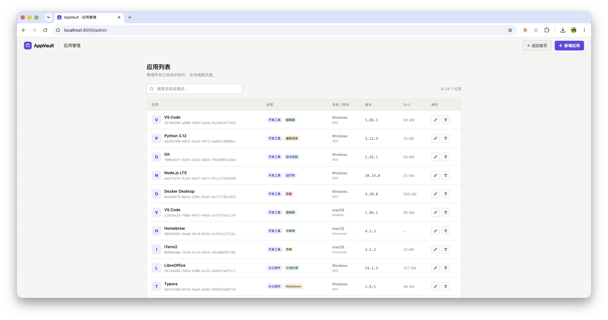

# App Vault · 内网软件下载中心

轻量级内网软件分发工具，基于 FastAPI + SQLite + Jinja2，提供下载前台与管理后台。




## 功能

- **下载前台**（`/`）：按标签、系统、架构筛选，支持搜索
- **管理后台**（`/admin`）：可视化增删改软件条目
- **REST API**（`/api/apps`）：供脚本或第三方集成

## 快速开始

### 方式一：Docker Compose（推荐）

```yaml
services:
  app-vault:
    image: uhub.service.ucloud.cn/allen2fuc/app-vault:latest
    container_name: app-vault
    restart: unless-stopped
    ports:
      - "8000:8000"
    volumes:
      - ./static/files:/app/static/files
      - ./static/icons:/app/static/icons
      - ./data:/app/data
    environment:
      DB_PATH: sqlite:///data/appvault.db
```

```bash
docker compose up -d
```

- 下载中心：http://localhost:8000
- 管理后台：http://localhost:8000/admin

### 方式二：本地运行

需要 [uv](https://docs.astral.sh/uv/)（Python ≥ 3.13）。

```bash
uv sync
make dev
```

等价命令：

```bash
uv run uvicorn src.main:app --reload --port 8000
```

首次启动会自动在 `data/appvault.db` 创建 SQLite 数据库。

## 添加软件

1. 将安装包放入 `static/files/` 目录
2. 将图标放入 `static/icons/` 目录
3. 打开 [管理后台](http://localhost:8000/admin) 新增条目，或调用 API：

```bash
curl -X POST http://localhost:8000/api/apps \
  -H "Content-Type: application/json" \
  -d '{
    "name": "My App",
    "description": "软件描述",
    "tags": ["开发工具"],
    "icon": "/static/icons/my-app.png",
    "version": "1.0.0",
    "size": "50 MB",
    "publisher": "发行商名称",
    "download_url": "/static/files/my-app-setup.exe",
    "os": "Windows",
    "arch": "x64"
  }'
```

## API 概览

| 方法 | 路径 | 说明 |
|------|------|------|
| GET | `/api/apps` | 列表，支持 `tag`、`os`、`arch`、`q` 查询参数 |
| GET | `/api/apps/{id}` | 获取单条 |
| POST | `/api/apps` | 新增 |
| PUT | `/api/apps/{id}` | 更新 |
| DELETE | `/api/apps/{id}` | 删除 |

## 环境变量

可在项目根目录创建 `.env` 文件：

| 变量 | 默认值 | 说明 |
|------|--------|------|
| `DB_PATH` | `sqlite:///data/appvault.db` | SQLite 连接字符串 |
| `DB_ECHO` | `false` | 是否打印 SQL 日志 |

## 配置 Traefik

修改 `docker-compose.yml` 中的 label：

```yaml
- "traefik.http.routers.app-vault.rule=Host(`apps.你的域名.com`)"
```

## 软件字段说明

| 字段 | 必填 | 说明 |
|------|------|------|
| name | 是 | 软件名称 |
| description | 否 | 软件描述 |
| tags | 是 | 标签列表（用于侧栏筛选，可自定义） |
| icon | 是 | 图标路径（如 `/static/icons/xxx.png`） |
| version | 是 | 版本号 |
| size | 是 | 文件大小（展示用，手动填写） |
| publisher | 是 | 发行商 |
| download_url | 是 | 下载路径（`/static/files/xxx` 或外部 URL） |
| os | 是 | 支持系统：`Windows` / `macOS` / `Linux` / `跨平台` |
| arch | 是 | 支持架构：`x64` / `x86` / `ARM64` / `Universal` |

`id`、`created_at`、`updated_at` 由系统自动生成。
